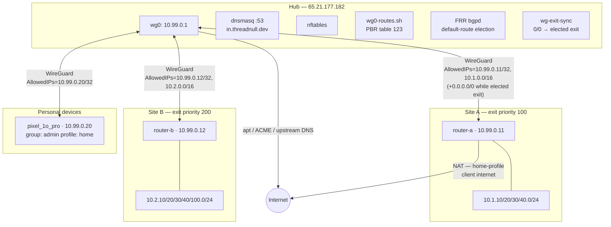
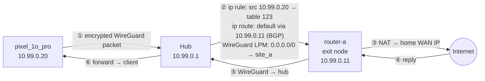
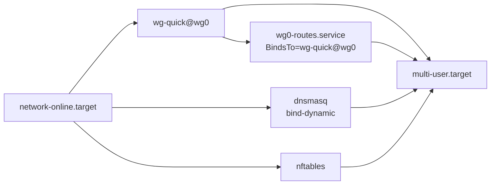

# Hub Overview

A hub-and-spoke WireGuard overlay over `10.99.0.0/24` connecting two MikroTik home
routers, personal devices, and optional service VPSes through a single Hetzner VPS
relay (`65.21.177.182`). All topology is declared in `group_vars/all/network.yml` —
the hub renders every artifact (WireGuard configs, firewall rules, DNS records, client
`.conf` files, MikroTik `.rsc` snippets) from it. Rendered output is never hand-edited.

---

## Network Topology



---

## Address Plan

| Range | Purpose | Max IPs |
|---|---|---|
| `10.99.0.1` | Hub (WireGuard interface address) | 1 |
| `10.99.0.11–19` | Site routers — site N gets `10.99.0.1N` | 9 |
| `10.99.0.20–99` | Personal client devices | 80 |
| `10.99.0.100–199` | Service VPSes | 100 |
| `10.N.K.0/24` | LAN of site N, VLAN K (e.g. `10.2.30.0/24` = site B IoT) | 254 |
| `99` | Reserved — never a site number | — |

---

## Hub Services

| systemd unit | Role | Reloads on peer change |
|---|---|---|
| `wg-quick@wg0` | WireGuard interface + kernel peer table | No — `wg syncconf` used |
| `wg0-routes.service` | Overlay route + PBR table 123 fail-closed floor (home egress) | Yes — full restart |
| `frr.service` | FRRouting bgpd — site LAN routes + exit default election via eBGP | No — BGP converges |
| `wg-exit-sync.service` | Programs table-123 default + wg AllowedIPs 0.0.0.0/0 from the BGP election | Yes — restart (re-adds 0/0 after syncconf) |
| `nftables` | Stateful firewall | Yes — `systemctl reload` |
| `dnsmasq` | Authoritative DNS for `in.threadnull.dev` | Yes — restart |
| `lego-renew.timer` | Daily wildcard cert renewal via Cloudflare DNS-01 | N/A |
| `fail2ban` | SSH brute-force ban (nftables backend) | No |
| `prometheus-node-exporter` | System metrics on :9100 (optional, `hub_metrics_enabled`) | No |
| `hub-metrics-textfile.timer` | WireGuard/exit/BGP `.prom` refresh every 15s (optional) | No |

---

## WireGuard

### Hub-and-Spoke Model

Every peer (router, device, service VPS) connects **to the hub** at `65.21.177.182:51820`.
The hub has no configured `Endpoint` for any peer — it learns endpoints dynamically from
WireGuard handshakes. MikroTik routers use `persistent-keepalive = 25s` to keep sessions
alive through NAT/CGNAT.

Peer-to-peer traffic (site_a ↔ site_b) is relayed through the hub. There is no direct
path between peers.

### AllowedIPs and Packet Routing

WireGuard selects which peer to encrypt a packet to using **longest-prefix-match** on
`AllowedIPs` — this is the WireGuard routing table, independent of the kernel routing
table.

| Peer | AllowedIPs on hub |
|---|---|
| site_a | `10.99.0.11/32, 10.1.0.0/16` (+ `0.0.0.0/0` while elected exit) |
| site_b | `10.99.0.12/32, 10.2.0.0/16` (+ `0.0.0.0/0` while elected exit) |
| pixel_1o_pro | `10.99.0.20/32` |

`0.0.0.0/0` is **runtime state, not config**: `wg-exit-sync` assigns it to whichever
exit-capable site currently holds the best BGP default (see *Exit failover* below),
and `wg0.conf` deliberately never contains it — after `wg syncconf` strips it, the
daemon re-adds it within ~1s.

`0.0.0.0/0` on the elected exit does **not** mean all traffic goes there.
More-specific entries win: a packet to `10.99.0.12` goes to site_b (`/32` beats
`0.0.0.0/0`). An unknown destination (internet-bound) falls through to the exit by LPM.

### `Table = off`

`wg0.conf` contains `Table = off`, which disables wg-quick's automatic kernel route
management (normally wg-quick adds routes from AllowedIPs). Routes are managed
separately by `wg0-routes.sh`. This allows:

- **Peer edits** → `wg syncconf` (no interface restart, no route flush, no handshake disruption)
- **Route edits** → `wg0-routes.service` restart (without touching peers)

### `wg syncconf` — Zero-Downtime Peer Updates

When `wg0.conf` changes (new peer, key rotation), the Ansible handler runs:

```bash
wg syncconf wg0 <(wg-quick strip /etc/wireguard/wg0.conf)
```

`wg-quick strip` removes the `[Interface]` section (which syncconf doesn't accept),
leaving only the `[Peer]` blocks. The kernel peer table is updated atomically —
existing sessions survive.

**Exception**: changes to `Address` or `ListenPort` require a full
`systemctl restart wg-quick@wg0` because syncconf only handles peers.

### Key Lifecycle

Keys are generated **on the hub** using `creates:` guards — they are never
regenerated on subsequent Ansible runs:

```
/etc/wireguard/server.priv / server.pub    — hub keypair
/etc/wireguard/clients/<name>.priv / .pub  — per-peer keypair
/etc/wireguard/clients/<name>.psk          — per-peer pre-shared key
```

Private material stays on the hub. Site routers receive their keypair embedded in
the rendered `.rsc` file. Service VPSes: the `vpn_member` role reads the private
key from the hub via `delegate_to` and writes it directly to the VPS — the key
never touches the Ansible control node. All key-reading tasks use `no_log: true`.

To force key rotation for a peer: delete the `.priv`, `.pub`, `.psk` files for that
peer and re-run `hub.yml`. The peer device must receive the new `.rsc` or `.conf`.

---

## Routing

`wg0-routes.sh` runs as a `oneshot` systemd unit, bound to `wg-quick@wg0`
(`BindsTo=` — if WireGuard stops, routes are torn down automatically).

### Routes Added on Start

```bash
# Overlay: all WireGuard peers are reachable via wg0
ip route replace 10.99.0.0/24 dev wg0

# Site LAN routes are NOT managed here — bgpd (frr.service) installs them
# dynamically via eBGP. Visible as: ip route show proto bgp
# When a site's WireGuard session drops, BGP withdraws its routes automatically.

# PBR table 123: fail-closed floor. wg-exit-sync installs the BGP-elected
# exit default here with metric 20 (which shadows the floor); when no exit
# site announces 0.0.0.0/0, the floor wins and home clients fail closed.
ip route replace unreachable default table 123 metric 4294967294

# Policy rules: home-profile clients use table 123
ip rule add from 10.99.0.20/32 table 123
```

### Policy-Based Routing (home-profile clients)

Devices with `profile: home` egress to the internet via the **elected exit site**
(normally site_a, the highest-priority one), not via the hub's own WAN:



The kernel applies `ip rule` to the packet's source IP, finds table 123, finds
the BGP-elected default there, then WireGuard picks the exit site (the only peer
holding `AllowedIPs = 0.0.0.0/0`, kept in sync by `wg-exit-sync`). The exit
router's own NAT masquerades the packet to its WAN IP.

Devices with `profile: cloud` (if configured) would use the hub's own public IP
via the masquerade rule in the nftables NAT table — no PBR needed.

### Exit Failover

Any site with `exit_priority` in `network.yml` is exit-capable and announces
`0.0.0.0/0` to the hub over the existing BGP session via
`output.default-originate=if-installed`: the default is originated only while
a default route is installed on the router (the dynamic ISP PPPoE/DHCP one),
so a dead WAN self-withdraws it while the LAN /16 stays announced.
(`output.network` cannot do this — it only picks up static routes, which is
why the /16 needs its blackhole anchor and the default does not.) On the hub:

1. **FRR** accepts a default only from exit-capable sites (route-map `OVERLAY-IN`,
   matched by nexthop) and prefers the lowest `exit_priority`
   (`local-pref = 1000 - priority`), so recovery preempts automatically. The
   elected default is deliberately **never installed by zebra** (route-map
   `BGP-TO-KERNEL` denies it): in the main table it must not hijack the hub's
   own egress during uplink flaps, and zebra's `set table` silently fails to
   load on FRR 10.
2. **wg-exit-sync** polls the election result from bgpd (vtysh JSON, every 5s)
   and programs both halves of the data path: the default in PBR table 123
   (`proto static`, metric 20 — shadows the unreachable floor) and WireGuard's
   `0.0.0.0/0` AllowedIPs on the elected site's peer with a single `wg set`
   (the kernel atomically steals the prefix from the previous owner).

Failure detection is bounded by the BGP hold timer plus the poll period
(`timers 5 15` on the OVERLAY peer-group + 5s poll → ~20s worst case for a
dead tunnel; a clean withdrawal fails over in ~5s). When **no** exit site
announces a default, the `unreachable` floor in table 123 fails home clients
closed — their traffic never leaks out of the hub's own uplink. Established
flows do break on failover (the exit NAT IP changes); applications reconnect.

### `net.ipv4.ip_forward`

The kernel drops forwarded packets silently if `net.ipv4.ip_forward = 0`, before
nftables even sees them. SSH to the hub still works (that hits the INPUT chain, not
FORWARD), making this failure invisible without explicitly checking the sysctl.

Written to `/etc/sysctl.d/99-wg-hub.conf` — the `99-` prefix ensures it loads
after all distro-supplied sysctl.d files and wins any conflicts.

---

## Firewall (nftables)

Two tables: `inet filter` (stateful, INPUT + FORWARD) and `inet nat` (masquerade).

### Named Sets (built from `network.yml` at render time)

| Set | Contents |
|---|---|
| `admin_ips` | IPs of `group: admin` clients |
| `user_ips` | IPs of `group: user` clients |
| `site_nets` | All site router IPs + all LAN subnets |
| `site_a_nets` | site_a router IP + its LAN subnets |
| `site_b_nets` | site_b router IP + its LAN subnets |
| `iot_nets` | `iot_subnets` entries from each site |
| `rfc1918` | `10.0.0.0/8, 172.16.0.0/12, 192.168.0.0/16` |

Adding or changing a peer in `network.yml` and re-running `hub.yml` rebuilds the
sets automatically.

### Input Chain (policy: DROP)

Accepts only:
1. `udp dport 51820` — WireGuard handshakes from anywhere on the internet
2. `iifname wg0; tcp dport 5860` — SSH, overlay only
3. `iifname wg0; udp/tcp dport 53` — DNS, overlay only

`hub_public_ssh: true` temporarily adds a public-IP SSH rule for bootstrap only.

### Forward Chain (policy: DROP)

| Rule | Who | What |
|---|---|---|
| `iifname wg0; saddr @admin_ips accept` | Admin clients | Full access to everything |
| `iifname wg0; oifname wg0; saddr @site_a_nets; daddr @site_b_nets accept` | Site-to-site | Bidirectional relay |
| `iifname wg0; oifname wg0; saddr @site_b_nets; daddr @site_a_nets accept` | Site-to-site | (reverse) |
| Generated service ingress/egress rules | Services | Per `network.yml` ingress/egress |
| `iifname wg0; saddr @user_ips; daddr != @rfc1918 accept` | User clients | Internet only, no LAN access |

Site-to-site rules match both `iifname wg0` and `oifname wg0` — the packet enters
from WireGuard and must exit via WireGuard (not the public interface).

### NAT Table

Masquerades cloud-profile client traffic leaving via the public interface (`eth0`).
Home-profile clients are NOT masqueraded at the hub — they are NATed at site_a's
own MikroTik router.

---

## DNS (dnsmasq)

dnsmasq listens exclusively on `10.99.0.1:53` (the hub's overlay IP):

```
listen-address=10.99.0.1
bind-dynamic          # handles the case where wg0 comes up after dnsmasq starts
no-resolv             # ignores /etc/resolv.conf
local=/in.threadnull.dev/   # authoritative — never forwarded upstream
```

All `*.in.threadnull.dev` host records are rendered from `network.yml`. External
queries are forwarded to `dns_upstreams` (configured in `settings.yml`):
- `10.99.0.11` — router-a running NextDNS (ad filtering for VPN clients)
- `1.1.1.1` — Cloudflare fallback when site_a is unreachable

### Why the Hub's Own Resolver Is Separate

`/etc/resolv.conf` on the hub is pinned to `1.1.1.1, 8.8.8.8` and made immutable
(`chattr +i`). If it pointed at dnsmasq (`10.99.0.1`), which forwards externals via
`10.99.0.11` (site_a), then a site_a outage would also break the hub's own DNS —
breaking `apt`, Let's Encrypt, and Cloudflare API. The immutable flag prevents dhclient
or any package from repointing `/etc/resolv.conf`.

### Client DNS Setup

Site routers forward `in.threadnull.dev` queries to the hub via a static DNS record
in RouterOS (now rendered automatically in the `.rsc` template):

```
/ip dns static add type=FWD name="in.threadnull.dev" forward-to=10.99.0.1
```

---

## Certificates

`lego` (ACME client) obtains a wildcard `*.in.threadnull.dev` via Cloudflare DNS-01.
The Cloudflare API token lives only in `group_vars/all/vault.yml` (ansible-vault
encrypted) and is deployed to `/etc/lego/cloudflare.env` (mode 0600, `no_log: true`).

**Renewal flow**:
1. `lego-renew.timer` fires daily at `04:17 + random(0–30 min)`
2. `lego-renew.service` runs `lego-renew.sh` — lego skips renewal if cert has > 30 days remaining
3. Fresh cert lands in `/var/lib/lego/`, copied to `/var/lib/wg-certs/` (owned by `certsync` system user)

**Service VPS cert pull**:
Each service VPS generates an ed25519 keypair and `vpn_member` authorizes it on the hub:

```
# In certsync's authorized_keys:
restrict,command="rrsync -ro /var/lib/wg-certs" <ed25519-pubkey> <service>-certsync
```

`rrsync -ro` restricts the connection to read-only rsync within `/var/lib/wg-certs`
only — the service VPS cannot write or access anything else. `cert-sync.timer` on
each service VPS pulls daily at `05:11`.

---

## Startup Sequence



`BindsTo=wg-quick@wg0` on `wg0-routes.service` means if WireGuard stops for any
reason, routing rules are cleaned up automatically. `bind-dynamic` on dnsmasq means
it doesn't fail if `wg0` doesn't exist yet when dnsmasq starts — it picks up
`10.99.0.1` when the interface appears.

---

## Configuration Model

`group_vars/all/network.yml` is the only file you edit to add a peer, site, or service.

```
network.yml  (sites, clients, services)
     │
     │  ansible-playbook playbooks/hub.yml
     ▼
wg_hub role (tasks/main.yml):
  1. Flatten into wg_hub_peers list (kind: site|client|service)
  2. Generate keypairs on hub (creates: — never overwrite)
  3. Slurp keys → wg_hub_peer_data / wg_hub_server_keys facts
  4. Render templates:
       wg0.conf              → /etc/wireguard/wg0.conf
       wg0-routes.sh         → /usr/local/sbin/wg0-routes.sh   (overlay + PBR only)
       nftables.conf         → /etc/nftables.conf
       dnsmasq-internal.conf → /etc/dnsmasq.d/wg-internal.conf
       client configs        → /etc/wireguard/clients/<name>.conf
       MikroTik snippets     → /etc/wireguard/clients/<name>.rsc  (WG + BGP)
  5. Handlers (only if changed):
       wg syncconf           — peer table update, no restart
       wg0-routes restart    — route entries
       nftables reload       — new firewall sets (pre-validated with nft -c)
       dnsmasq restart       — new host records
       systemd-sysctl restart — ip_forward drop-in applied

frr_hub role (tasks/main.yml):
  - Installs frr, enables bgpd
  - Deploys /etc/frr/frr.conf: router bgp 65001, bgp listen range 10.99.0.0/24
  - Site LAN routes arrive via eBGP — no static routes required
```

**Playbooks**:
- `hub.yml` → `base_hardening` + `wg_hub` + `frr_hub` + `certs_hub`
- `services.yml` → `base_hardening` + `vpn_member` (run per service VPS, after hub.yml)

---

## Design Decisions

**Why wg0.conf is split from routes**: If PostUp/PreDown managed routes, any peer
change (new device, key rotation) would require a full `wg-quick down/up`, dropping
all active sessions. With `Table = off` and a separate `wg0-routes.service`,
`wg syncconf` can update peers atomically with zero disruption.

**Why sysctl.d/99-wg-hub.conf**: A `copy` task writes exactly one line to
`/etc/sysctl.d/99-wg-hub.conf`. The `99-` prefix ensures it loads after all
distro-supplied sysctl.d files and wins any conflicts. The handler restarts
`systemd-sysctl.service` to apply the value immediately during the run.

**Why BGP over static site LAN routes**: With static `ip route` entries in
`wg0-routes.sh`, a site going down leaves its routes in the kernel — traffic
is silently blackholed until a manual restart. With eBGP, when the WireGuard
session drops the BGP hold-timer expires and bgpd withdraws the routes
automatically. No stale routes, no manual intervention.

**Why dnsmasq not on 127.0.0.1**: Clients query `10.99.0.1:53`. Binding on loopback
would require NAT rules; binding on the overlay IP is cleaner and self-documenting —
you can only reach DNS if you're on the overlay.

**Why `nft -c` before deploy**: `validate: "nft -c -f %s"` in the nftables task
runs a syntax+semantic check against a temp file before Ansible replaces the live
config. A bad template change cannot lock you out of the hub (nftables deploy fails,
leaving the current ruleset in place).

**Why keys in `creates:` guards**: Existing keys are never overwritten on re-runs.
This makes `hub.yml` safe to run repeatedly without invalidating all peer sessions.
Key rotation is an explicit action (delete the files, re-run).

---

## Operational Reference

### Health Check — One Liner

```bash
echo "=== ip_forward ===" && sysctl net.ipv4.ip_forward && \
echo "=== Services ===" && systemctl is-active wg-quick@wg0 wg0-routes nftables dnsmasq frr && \
echo "=== WireGuard peers ===" && sudo wg show wg0 latest-handshakes && \
echo "=== BGP ===" && sudo vtysh -c "show bgp summary" && \
echo "=== BGP routes ===" && ip route show proto bgp && \
echo "=== Routing ===" && ip route show table 123 && ip rule show && \
echo "=== DNS ===" && dig +short @10.99.0.1 hub.in.threadnull.dev
```

Expected: `ip_forward = 1`, all services `active`, all peers with handshake < 120s,
BGP `State/PfxRcd` shows `Established/1` per connected site, `ip route show proto bgp`
lists `10.N.0.0/16` per site, DNS returns `10.99.0.1`.

### FRR / BGP

```bash
# Session state: Up/Down, uptime, prefixes received
sudo vtysh -c "show bgp summary"

# All BGP routes received from sites
sudo vtysh -c "show bgp ipv4 unicast"

# Running FRR config (live, not frr.conf on disk)
sudo vtysh -c "show running-config"

# Site LAN routes installed in kernel (proto bgp = installed by bgpd)
ip route show proto bgp

# FRR service status and recent log
systemctl status frr
sudo journalctl -u frr -n 50 --no-pager
```

---

### WireGuard

```bash
# Full status: peers, endpoints, handshake times, traffic
sudo wg show wg0

# Handshake ages only (all peers; should be < 120s with keepalive=25s)
sudo wg show wg0 latest-handshakes

# Traffic per peer (TX/RX bytes — useful to spot dead peers with 0 traffic)
sudo wg show wg0 transfer

# Apply updated peer list without restarting the tunnel
sudo wg syncconf wg0 <(wg-quick strip /etc/wireguard/wg0.conf)

# Full restart (required only after Address/ListenPort change)
sudo systemctl restart wg-quick@wg0

# Show all rendered peer configs (keys included — handle with care)
sudo cat /etc/wireguard/wg0.conf
```

---

### Firewall

```bash
# Show the live ruleset (what the kernel actually has — not the file on disk)
sudo nft list ruleset

# Inspect a specific chain
sudo nft list chain inet filter input
sudo nft list chain inet filter forward

# Inspect named sets (who's in admin_ips, site_a_nets, etc.)
sudo nft list set inet filter admin_ips
sudo nft list set inet filter site_a_nets

# Show drop counters (nftables logs with prefix + counter on drop rules)
sudo nft list ruleset | grep -E 'counter|drop'

# Validate /etc/nftables.conf without applying it
sudo nft -c -f /etc/nftables.conf

# Reload from file (safe — validates first via nftables.service ExecReload)
sudo systemctl reload nftables

# DIAGNOSTIC ONLY: flush all rules (allows everything — restore immediately)
sudo nft flush ruleset
sudo systemctl reload nftables   # restore
```

---

### DNS

```bash
# Verify dnsmasq responds correctly for each peer type
dig @10.99.0.1 hub.in.threadnull.dev
dig @10.99.0.1 router-a.in.threadnull.dev
dig @10.99.0.1 router-b.in.threadnull.dev

# Verify dnsmasq is bound to the right address and port
ss -ulnp | grep :53

# Check systemd-resolved isn't stealing port 53 (common on Ubuntu)
systemctl status systemd-resolved

# Live dnsmasq query log
journalctl -u dnsmasq -f

# Restart dnsmasq (e.g. after manual config edit)
sudo systemctl restart dnsmasq
```

---

### Routes

```bash
# Routes via wg0 (should include 10.99.0.0/24 and all site LAN subnets)
ip route show | grep wg0

# All policy routing rules (should have one entry per home-profile client)
ip rule show

# Table 123 contents (should have: default via 10.99.0.1N proto static
# metric 20 installed by wg-exit-sync, and the fail-closed floor:
# unreachable default metric 4294967294)
ip route show table 123

# Which peer currently owns 0.0.0.0/0 (must match the BGP nexthop above)
sudo wg show wg0 allowed-ips | grep 0.0.0.0/0

# Exit failover daemon
systemctl status wg-exit-sync
journalctl -u wg-exit-sync -n 20

# wg0-routes service status and last run output
systemctl status wg0-routes
journalctl -u wg0-routes --no-pager

# Re-run routes script manually (e.g. after debugging)
sudo /usr/local/sbin/wg0-routes.sh up

# Critical check
sysctl net.ipv4.ip_forward   # must be 1 — if 0, ALL forwarding silently fails
```

---

### Certificates

```bash
# Check expiry of the live cert
sudo openssl x509 -noout -dates \
  -in /var/lib/lego/certificates/_.in.threadnull.dev.crt

# Run renewal manually (lego skips if > 30 days remain — safe to run anytime)
sudo systemctl start lego-renew.service
journalctl -u lego-renew.service --no-pager

# When does the next renewal run?
systemctl list-timers lego-renew.timer

# Service VPS cert sync status (run on the service VPS)
systemctl list-timers cert-sync.timer
journalctl -u cert-sync.service --no-pager
```

---

### Logs

```bash
# Per-service logs
journalctl -u wg-quick@wg0   --since "1 hour ago"
journalctl -u wg0-routes      --since "1 hour ago"
journalctl -u nftables        --since "1 hour ago"
journalctl -u dnsmasq         --since "10 minutes ago"

# Exit failover decisions
journalctl -u wg-exit-sync    --since "1 hour ago"

# All hub services in one stream
journalctl -u wg-quick@wg0 -u wg0-routes -u wg-exit-sync -u nftables -u dnsmasq \
  --since "1 hour ago" --no-pager

# Dropped packets logged by nftables (prefix set in nftables.conf.j2)
journalctl -k | grep "nft_forward_drop\|nft_input_drop"

# Follow all hub service logs live
journalctl -u wg-quick@wg0 -u wg0-routes -u nftables -u dnsmasq -f
```

---

### Troubleshooting Decision Tree

**Cannot reach a peer (ping/ssh timeout)**

```
1. Is ip_forward enabled?
   $ sysctl net.ipv4.ip_forward
   → 0: sudo sysctl -w net.ipv4.ip_forward=1
         verify /etc/sysctl.d/99-wg-hub.conf contains the setting

2. Does the target peer have an active WireGuard session?
   $ sudo wg show wg0 latest-handshakes
   → no handshake / very old: peer's WireGuard config is broken or service is down
     check keys match what hub generated; verify persistent-keepalive on peer side

3. Is the nftables FORWARD chain allowing this traffic?
   $ sudo nft list chain inet filter forward
   → no matching rule: re-run hub.yml or add rule in network.yml
     quick test: sudo nft flush ruleset (restore: sudo systemctl reload nftables)

4. Is the route to the destination via wg0?
   $ ip route show | grep wg0
   → missing: sudo systemctl restart wg0-routes
```

**DNS does not resolve `*.in.threadnull.dev`**

```
1. Does dnsmasq answer directly?
   $ dig @10.99.0.1 <name>.in.threadnull.dev
   → NXDOMAIN or timeout:
     systemctl status dnsmasq
     ss -ulnp | grep :53   (is 10.99.0.1:53 listed?)
     journalctl -u dnsmasq --no-pager

2. If dig works but client still can't resolve:
   → Client is not querying 10.99.0.1
     On MikroTik: /ip dns print  (check FWD record for in.threadnull.dev)
     On Linux client: resolvectl status / cat /etc/resolv.conf
```

**Mobile device has no internet through VPN**

```
1. Is the PBR rule in place?
   $ ip rule show | grep <client-ip>

2. Is table 123 populated?
   $ ip route show table 123
   (should show: default via 10.99.0.1N proto static metric 20
                 + unreachable default metric 4294967294)
   → only the unreachable floor: no exit site is announcing 0.0.0.0/0
     (fail-closed by design) — check BGP: vtysh -c 'show bgp ipv4 unicast 0.0.0.0/0'

3. Does WireGuard 0.0.0.0/0 match the BGP nexthop?
   $ sudo wg show wg0 allowed-ips   (elected exit peer must hold 0.0.0.0/0)
   $ journalctl -u wg-exit-sync -n 20

4. Does the exit site have an active handshake?
   $ sudo wg show wg0 latest-handshakes

5. Does the exit site's MikroTik masquerade traffic from 10.99.0.0/24?
   (Hub does NOT masquerade home-profile clients — that's the exit's job)
```

---

### Change Workflow

**Add a device, site, or service:**

```bash
# 1. Declare it in the model
vim group_vars/all/network.yml

# 2. Dry-run (requires WireGuard connectivity to hub and vault password)
ansible-playbook playbooks/hub.yml --check --diff --ask-vault-pass

# 3. Apply
ansible-playbook playbooks/hub.yml --ask-vault-pass

# 4a. For a site router — paste the generated .rsc on the MikroTik:
sudo cat /etc/wireguard/clients/<site_name>.rsc

# 4b. For a personal device — show QR code:
sudo qrencode -t ansiutf8 < /etc/wireguard/clients/<name>.conf

# 4c. For a service VPS:
ansible-playbook playbooks/services.yml --limit <host> --ask-vault-pass
```

**Force key rotation for a peer:**

```bash
sudo rm /etc/wireguard/clients/<name>.priv \
        /etc/wireguard/clients/<name>.pub \
        /etc/wireguard/clients/<name>.psk
ansible-playbook playbooks/hub.yml --ask-vault-pass
# Then re-deliver the new .rsc or .conf to the peer device
```

**SSH to hub:**

```bash
# Normal (WireGuard must be up)
ssh -p 5860 wg@10.99.0.1

# Emergency (WireGuard down / locked out)
# Use Hetzner Cloud Console → KVM console → rescue mode
```
