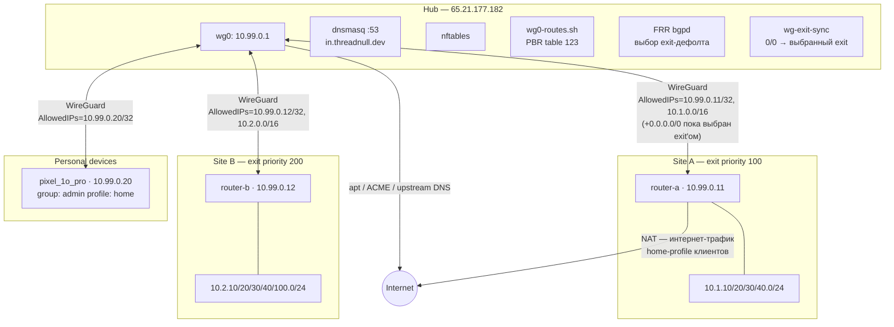
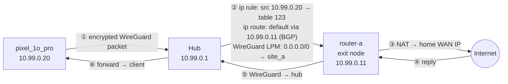
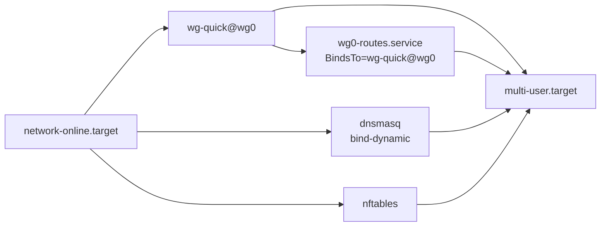

# Обзор хаба

Сеть построена по схеме hub-and-spoke на базе WireGuard в диапазоне `10.99.0.0/24`.
Через единственный VPS на Hetzner (`65.21.177.182`) связаны два домашних роутера
MikroTik, персональные устройства и опциональные сервисные VPS. Вся топология описана
в `group_vars/all/network.yml` — хаб генерирует из него все артефакты: конфиги
WireGuard, правила файрвола, DNS-записи, `.conf`-файлы для клиентов, `.rsc`-сниппеты
для MikroTik. Сгенерированные файлы никогда не редактируются вручную.

---

## Сетевая топология



---

## Адресный план

| Диапазон | Назначение | Макс. адресов |
|---|---|---|
| `10.99.0.1` | Хаб (адрес WireGuard-интерфейса) | 1 |
| `10.99.0.11–19` | Роутеры сайтов — сайт N получает `10.99.0.1N` | 9 |
| `10.99.0.20–99` | Персональные клиентские устройства | 80 |
| `10.99.0.100–199` | Сервисные VPS | 100 |
| `10.N.K.0/24` | LAN сайта N, VLAN K (например `10.2.30.0/24` = IoT сайта B) | 254 |
| `99` | Зарезервировано — никогда не используется как номер сайта | — |

---

## Сервисы хаба

| systemd unit | Роль | Перезагружается при изменении пиров |
|---|---|---|
| `wg-quick@wg0` | WireGuard-интерфейс + таблица пиров в ядре | Нет — используется `wg syncconf` |
| `wg0-routes.service` | Маршрут оверлея + fail-closed пол table 123 (интернет для home) | Да — полный рестарт |
| `frr.service` | FRRouting bgpd — LAN-маршруты сайтов + выбор exit-дефолта через eBGP | Нет — BGP сходится сам |
| `wg-exit-sync.service` | Программирует дефолт table 123 + wg AllowedIPs 0.0.0.0/0 из BGP election | Да — рестарт (возвращает 0/0 после syncconf) |
| `nftables` | Stateful-файрвол | Да — `systemctl reload` |
| `dnsmasq` | Авторитетный DNS для `in.threadnull.dev` | Да — рестарт |
| `lego-renew.timer` | Ежедневное обновление wildcard-сертификата через Cloudflare DNS-01 | Н/П |
| `fail2ban` | Защита SSH от брутфорса (backend: nftables) | Нет |

---

## WireGuard

### Модель hub-and-spoke

Все пиры (роутеры, устройства, сервисные VPS) подключаются **к хабу** по адресу
`65.21.177.182:51820`. Хаб не имеет сконфигурированного `Endpoint` ни для одного
пира — он узнаёт адреса динамически из WireGuard-хендшейков. Роутеры MikroTik
используют `persistent-keepalive = 25s` для поддержания сессии через NAT/CGNAT.

Трафик между пирами (site_a ↔ site_b) ретранслируется через хаб. Прямого пути между
пирами нет.

### AllowedIPs и маршрутизация пакетов

WireGuard выбирает, к какому пиру зашифровать пакет, используя **longest-prefix-match**
по `AllowedIPs` — это собственная таблица маршрутизации WireGuard, независимая от
таблицы ядра.

| Пир | AllowedIPs на хабе |
|---|---|
| site_a | `10.99.0.11/32, 10.1.0.0/16` (+ `0.0.0.0/0`, пока выбран exit'ом) |
| site_b | `10.99.0.12/32, 10.2.0.0/16` (+ `0.0.0.0/0`, пока выбран exit'ом) |
| pixel_1o_pro | `10.99.0.20/32` |

`0.0.0.0/0` — **runtime-состояние, а не конфиг**: `wg-exit-sync` отдаёт его тому
exit-сайту, который сейчас держит лучший BGP-дефолт (см. *Exit failover* ниже);
в `wg0.conf` его намеренно нет — после `wg syncconf` демон возвращает его за ~1 с.

`0.0.0.0/0` у выбранного exit **не означает**, что весь трафик идёт к нему. Более
специфичные записи выигрывают: пакет до `10.99.0.12` уходит к site_b (`/32`
приоритетнее `0.0.0.0/0`). Пакет до неизвестного адреса (интернет) по LPM попадает
к exit-сайту.

### `Table = off`

В `wg0.conf` задан `Table = off`, что отключает автоматическое управление маршрутами
ядра со стороны wg-quick (без этого wg-quick добавлял бы маршруты на основе
AllowedIPs). Маршруты управляются отдельно через `wg0-routes.sh`. Это позволяет:

- **Изменение пиров** → `wg syncconf` (без рестарта интерфейса, без сброса маршрутов, без разрыва сессий)
- **Изменение маршрутов** → рестарт `wg0-routes.service` (без затрагивания пиров)

### `wg syncconf` — обновление пиров без даунтайма

При изменении `wg0.conf` (новый пир, ротация ключей) Ansible-хендлер выполняет:

```bash
wg syncconf wg0 <(wg-quick strip /etc/wireguard/wg0.conf)
```

`wg-quick strip` убирает секцию `[Interface]` (syncconf её не принимает), оставляя
только блоки `[Peer]`. Таблица пиров в ядре обновляется атомарно — существующие
сессии сохраняются.

**Исключение**: изменения `Address` или `ListenPort` требуют полного
`systemctl restart wg-quick@wg0`, так как syncconf работает только с пирами.

### Жизненный цикл ключей

Ключи генерируются **на хабе** с использованием `creates:` — они никогда не
перегенерируются при повторных запусках Ansible:

```
/etc/wireguard/server.priv / server.pub    — keypair хаба
/etc/wireguard/clients/<name>.priv / .pub  — keypair пира
/etc/wireguard/clients/<name>.psk          — pre-shared key пира
```

Приватный материал остаётся на хабе. Роутеры сайтов получают свой keypair внутри
сгенерированного `.rsc`-файла. Сервисные VPS: роль `vpn_member` читает приватный ключ
с хаба через `delegate_to` и записывает его напрямую на VPS — ключ никогда не
проходит через Ansible control node. Все задачи чтения ключей используют `no_log: true`.

Для принудительной ротации ключей пира: удалить файлы `.priv`, `.pub`, `.psk` для
этого пира и запустить `hub.yml` заново. На устройство пира нужно доставить новый
`.rsc` или `.conf`.

---

## Маршрутизация

`wg0-routes.sh` запускается как `oneshot` systemd unit, привязанный к
`wg-quick@wg0` (`BindsTo=` — если WireGuard останавливается, маршруты автоматически
удаляются).

### Маршруты, добавляемые при старте

```bash
# Оверлей: все WireGuard-пиры доступны через wg0
ip route replace 10.99.0.0/24 dev wg0

# LAN-маршруты сайтов НЕ управляются здесь — bgpd (frr.service) устанавливает
# их динамически через eBGP. Просмотр: ip route show proto bgp
# При падении WireGuard-сессии сайта BGP автоматически отзывает его маршруты.

# PBR table 123: fail-closed пол. wg-exit-sync устанавливает сюда
# BGP-выбранный exit-дефолт с metric 20 (он затеняет пол); когда ни один
# exit-сайт не анонсирует 0.0.0.0/0, побеждает пол и home-клиенты остаются
# без интернета (fail closed), а не утекают через аплинк хаба.
ip route replace unreachable default table 123 metric 4294967294

# Policy rules: home-profile клиенты используют table 123
ip rule add from 10.99.0.20/32 table 123
```

### Policy-Based Routing (home-profile клиенты)

Устройства с `profile: home` выходят в интернет через **выбранный exit-сайт**
(в норме site_a — у него высший приоритет), а не через WAN хаба:



Ядро применяет `ip rule` к source IP пакета, находит table 123, находит там
BGP-выбранный дефолт, WireGuard выбирает exit-сайт (единственный пир с
`AllowedIPs = 0.0.0.0/0`, который поддерживает `wg-exit-sync`). Роутер exit-сайта
маскарадит пакет под свой WAN-адрес.

Устройства с `profile: cloud` (если настроены) выходят через публичный IP хаба
через masquerade в nftables NAT table — PBR для них не нужен.

### Exit failover

Любой сайт с `exit_priority` в `network.yml` является exit-способным и анонсирует
хабу `0.0.0.0/0` по существующей BGP-сессии через
`output.default-originate=if-installed`: дефолт анонсируется только пока на
роутере установлен маршрут по умолчанию (динамический от ISP PPPoE/DHCP) —
умер WAN → дефолт отозван, LAN /16 при этом остаётся анонсированным.
(`output.network` для этого не годится — он подхватывает только статические
маршруты, поэтому /16 нужен blackhole-якорь, а дефолту — нет.) На хабе:

1. **FRR** принимает дефолт только от exit-способных сайтов (route-map
   `OVERLAY-IN`, матч по nexthop) и предпочитает наименьший `exit_priority`
   (`local-pref = 1000 - priority`) — при восстановлении приоритетного сайта
   происходит автоматический preempt. Выбранный дефолт zebra **намеренно не
   устанавливает в ядро** (route-map `BGP-TO-KERNEL` его режет): в main он
   мог бы захватить egress самого хаба при флапе аплинка, а `set table` в
   FRR 10 молча не загружается.
2. **wg-exit-sync** опрашивает результат election у bgpd (vtysh JSON, каждые
   5 с) и программирует обе половины data path: дефолт в PBR table 123
   (`proto static`, metric 20 — затеняет unreachable-пол) и `0.0.0.0/0` в
   AllowedIPs пира выбранного сайта одной командой `wg set` (ядро атомарно
   забирает префикс у прежнего владельца).

Детект отказа ограничен BGP hold-таймером плюс период опроса (`timers 5 15`
на peer-group OVERLAY + 5 с poll → худший случай ~20 с при смерти туннеля;
чистый withdrawal переключается за ~5 с). Когда дефолт не анонсирует **ни
один** exit-сайт, срабатывает `unreachable`-пол в table 123 — home-клиенты
остаются без интернета (fail closed), трафик никогда не утекает через аплинк
хаба. Установленные соединения при переключении рвутся (меняется NAT IP
exit-сайта) — приложения переподключаются сами.

### `net.ipv4.ip_forward`

При `net.ipv4.ip_forward = 0` ядро молча дропает все форвардируемые пакеты — до
nftables они даже не доходят. SSH на хаб при этом работает (пакеты попадают в
цепочку INPUT, а не FORWARD), что делает проблему невидимой без явной проверки.

Значение записано в `/etc/sysctl.d/99-wg-hub.conf` — префикс `99-` гарантирует
загрузку позже всех системных файлов sysctl.d и победу при конфликтах.

---

## Файрвол (nftables)

Два table: `inet filter` (stateful, INPUT + FORWARD) и `inet nat` (masquerade).

### Named Sets (строятся из `network.yml` при рендеринге)

| Set | Содержимое |
|---|---|
| `admin_ips` | IP-адреса клиентов с `group: admin` |
| `user_ips` | IP-адреса клиентов с `group: user` |
| `site_nets` | IP всех роутеров сайтов + все LAN-подсети |
| `site_a_nets` | IP роутера site_a + его LAN-подсети |
| `site_b_nets` | IP роутера site_b + его LAN-подсети |
| `iot_nets` | Записи `iot_subnets` из каждого сайта |
| `rfc1918` | `10.0.0.0/8, 172.16.0.0/12, 192.168.0.0/16` |

Добавление или изменение пира в `network.yml` с повторным запуском `hub.yml`
перестраивает sets автоматически.

### Цепочка Input (policy: DROP)

Принимает только:
1. `udp dport 51820` — WireGuard handshakes из любой точки интернета
2. `iifname wg0; tcp dport 5860` — SSH только через оверлей
3. `iifname wg0; udp/tcp dport 53` — DNS только через оверлей

`hub_public_ssh: true` временно добавляет SSH-правило с публичного IP — только для
начального развёртывания (bootstrap).

### Цепочка Forward (policy: DROP)

| Правило | Кто | Что |
|---|---|---|
| `iifname wg0; saddr @admin_ips accept` | Admin-клиенты | Полный доступ ко всему |
| `iifname wg0; oifname wg0; saddr @site_a_nets; daddr @site_b_nets accept` | Site-to-site | Двунаправленная ретрансляция |
| `iifname wg0; oifname wg0; saddr @site_b_nets; daddr @site_a_nets accept` | Site-to-site | (обратное направление) |
| Сгенерированные ingress/egress-правила сервисов | Сервисы | По `network.yml` |
| `iifname wg0; saddr @user_ips; daddr != @rfc1918 accept` | User-клиенты | Только интернет, без доступа к LAN |

Правила site-to-site проверяют и `iifname wg0`, и `oifname wg0` — трафик входит через
WireGuard и должен выходить тоже через WireGuard (не через публичный интерфейс).

### NAT table

Маскарадит трафик cloud-profile клиентов, выходящий через публичный интерфейс (`eth0`).
Home-profile клиенты **не** маскарадятся на хабе — это делает роутер site_a.

---

## DNS (dnsmasq)

dnsmasq слушает исключительно на `10.99.0.1:53` (overlay IP хаба):

```
listen-address=10.99.0.1
bind-dynamic          # подхватывает адрес когда wg0 поднимается позже dnsmasq
no-resolv             # игнорирует /etc/resolv.conf
local=/in.threadnull.dev/   # авторитетная зона — никогда не форвардится upstream
```

Все host-записи `*.in.threadnull.dev` рендерятся из `network.yml`. Внешние запросы
форвардятся в `dns_upstreams` (настраивается в `settings.yml`):
- `10.99.0.11` — router-a с NextDNS (блокировка рекламы для VPN-клиентов)
- `1.1.1.1` — Cloudflare fallback при недоступности site_a

### Почему собственный резолвер хаба независим

`/etc/resolv.conf` на хабе прибит к `1.1.1.1, 8.8.8.8` и сделан immutable
(`chattr +i`). Если бы он указывал на dnsmasq (`10.99.0.1`), который форвардит
внешние запросы через `10.99.0.11` (site_a), то при падении site_a сломался бы и
собственный DNS хаба — а с ним `apt`, Let's Encrypt и Cloudflare API. Immutable-флаг
не даёт dhclient или любому пакету перезаписать `/etc/resolv.conf`.

### Настройка DNS на клиентах

Роутеры сайтов форвардят запросы `in.threadnull.dev` на хаб через статическую
DNS-запись в RouterOS (теперь рендерится автоматически в `.rsc`-шаблоне):

```
/ip dns static add type=FWD name="in.threadnull.dev" forward-to=10.99.0.1
```

---

## Сертификаты

`lego` (ACME-клиент) получает wildcard `*.in.threadnull.dev` через Cloudflare DNS-01.
Токен Cloudflare API хранится только в `group_vars/all/vault.yml` (зашифровано
ansible-vault) и деплоится в `/etc/lego/cloudflare.env` (режим 0600, `no_log: true`).

**Процесс обновления**:
1. `lego-renew.timer` срабатывает ежедневно в `04:17 + random(0–30 мин)`
2. `lego-renew.service` запускает `lego-renew.sh` — lego пропускает обновление, если до истечения > 30 дней
3. Свежий сертификат попадает в `/var/lib/lego/`, копируется в `/var/lib/wg-certs/` (владелец — системный пользователь `certsync`)

**Получение сертификата на сервисном VPS**:
Каждый сервисный VPS генерирует ed25519-keypair, и роль `vpn_member` авторизует его
на хабе:

```
# В authorized_keys пользователя certsync:
restrict,command="rrsync -ro /var/lib/wg-certs" <ed25519-pubkey> <service>-certsync
```

`rrsync -ro` ограничивает соединение read-only rsync строго в пределах
`/var/lib/wg-certs` — сервисный VPS не может ничего записать или получить доступ
к чему-либо ещё. `cert-sync.timer` на сервисных VPS синхронизирует ежедневно в `05:11`.

---

## Последовательность запуска



`BindsTo=wg-quick@wg0` в `wg0-routes.service` означает: если WireGuard останавливается
по любой причине, правила маршрутизации удаляются автоматически. `bind-dynamic` у
dnsmasq означает, что он не падает при старте, если `wg0` ещё не поднят — он
подхватывает `10.99.0.1` когда интерфейс появляется.

---

## Модель конфигурации

`group_vars/all/network.yml` — единственный файл, который редактируется для добавления
пира, сайта или сервиса.

```
network.yml  (sites, clients, services)
     │
     │  ansible-playbook playbooks/hub.yml
     ▼
wg_hub role (tasks/main.yml):
  1. Сворачивает всё в список wg_hub_peers (kind: site|client|service)
  2. Генерирует keypairs на хабе (creates: — никогда не перезаписывает)
  3. Slurp ключей → facts wg_hub_peer_data / wg_hub_server_keys
  4. Рендерит шаблоны:
       wg0.conf              → /etc/wireguard/wg0.conf
       wg0-routes.sh         → /usr/local/sbin/wg0-routes.sh   (оверлей + PBR)
       nftables.conf         → /etc/nftables.conf
       dnsmasq-internal.conf → /etc/dnsmasq.d/wg-internal.conf
       client configs        → /etc/wireguard/clients/<name>.conf
       MikroTik snippets     → /etc/wireguard/clients/<name>.rsc  (WG + BGP)
  5. Хендлеры (только при изменениях):
       wg syncconf           — обновление таблицы пиров, без рестарта
       wg0-routes restart    — маршруты
       nftables reload       — новые sets файрвола (предварительная валидация nft -c)
       dnsmasq restart       — новые host-записи
       systemd-sysctl restart — применение ip_forward drop-in

frr_hub role (tasks/main.yml):
  - Устанавливает frr, включает bgpd
  - Деплоит /etc/frr/frr.conf: router bgp 65001, bgp listen range 10.99.0.0/24
  - LAN-маршруты сайтов поступают через eBGP — статические маршруты не нужны
```

**Playbooks**:
- `hub.yml` → `base_hardening` + `wg_hub` + `frr_hub` + `certs_hub`
- `services.yml` → `base_hardening` + `vpn_member` (запускать для каждого сервисного VPS, после hub.yml)

---

## Архитектурные решения

**Почему wg0.conf отделён от маршрутов**: Если бы маршруты управлялись через
PostUp/PreDown, любое изменение пиров (новое устройство, ротация ключей) требовало бы
полного `wg-quick down/up`, сбрасывая все активные сессии. С `Table = off` и отдельным
`wg0-routes.service` команда `wg syncconf` обновляет пиров атомарно без разрывов.

**Почему sysctl.d/99-wg-hub.conf**: Задача `copy` записывает ровно одну строку в
`/etc/sysctl.d/99-wg-hub.conf`. Префикс `99-` гарантирует загрузку позже всех системных
файлов sysctl.d и победу при конфликтах. Хендлер перезапускает `systemd-sysctl.service`
для немедленного применения значения во время Ansible-прогона.

**Почему BGP вместо статических LAN-маршрутов сайтов**: При статических `ip route` в
`wg0-routes.sh` падение сайта оставляет его маршруты в ядре — трафик молча дропается до
ручного перезапуска. С eBGP при падении WireGuard-сессии истекает BGP hold-timer и bgpd
автоматически отзывает маршруты. Нет зависших маршрутов, нет ручного вмешательства.

**Почему dnsmasq не на 127.0.0.1**: Клиенты обращаются к `10.99.0.1:53`. Привязка
на loopback потребовала бы NAT-правил; привязка на overlay IP чище и самодокументирована
— к DNS можно обратиться только находясь в оверлее.

**Почему `nft -c` перед деплоем**: `validate: "nft -c -f %s"` в задаче nftables
выполняет синтаксическую и семантическую проверку на временном файле до того, как
Ansible заменяет live-конфиг. Плохое изменение шаблона не заблокирует доступ к хабу
— деплой nftables завершится ошибкой, текущий ruleset останется в силе.

**Почему ключи защищены `creates:`**: Существующие ключи никогда не перезаписываются
при повторных запусках. Это делает `hub.yml` безопасным для многократного выполнения
без инвалидации сессий пиров. Ротация ключей — явное действие (удалить файлы,
перезапустить).

---

## Операционный справочник

### Быстрая проверка состояния

```bash
echo "=== ip_forward ===" && sysctl net.ipv4.ip_forward && \
echo "=== Services ===" && systemctl is-active wg-quick@wg0 wg0-routes nftables dnsmasq frr && \
echo "=== WireGuard peers ===" && sudo wg show wg0 latest-handshakes && \
echo "=== BGP ===" && sudo vtysh -c "show bgp summary" && \
echo "=== BGP routes ===" && ip route show proto bgp && \
echo "=== Routing ===" && ip route show table 123 && ip rule show && \
echo "=== DNS ===" && dig +short @10.99.0.1 hub.in.threadnull.dev
```

Ожидаемый результат: `ip_forward = 1`, все сервисы `active`, все пиры с handshake
< 120 сек, BGP `State/PfxRcd` показывает `Established/1` для каждого подключённого
сайта, `ip route show proto bgp` содержит `10.N.0.0/16` для каждого сайта, DNS
возвращает `10.99.0.1`.

### FRR / BGP

```bash
# Состояние сессий: Up/Down, uptime, количество принятых префиксов
sudo vtysh -c "show bgp summary"

# Все BGP-маршруты, полученные от сайтов
sudo vtysh -c "show bgp ipv4 unicast"

# Текущая конфигурация FRR (живая, не frr.conf на диске)
sudo vtysh -c "show running-config"

# LAN-маршруты сайтов в таблице ядра (proto bgp = установлено bgpd)
ip route show proto bgp

# Статус сервиса FRR и последние логи
systemctl status frr
sudo journalctl -u frr -n 50 --no-pager
```

---

### WireGuard

```bash
# Полный статус: пиры, endpoints, время handshake, трафик
sudo wg show wg0

# Только возраст handshake (все пиры; при keepalive=25s должно быть < 120s)
sudo wg show wg0 latest-handshakes

# Трафик на пир (TX/RX в байтах — выявляет мёртвые пиры с нулевым трафиком)
sudo wg show wg0 transfer

# Применить обновлённый список пиров без рестарта тоннеля
sudo wg syncconf wg0 <(wg-quick strip /etc/wireguard/wg0.conf)

# Полный рестарт (нужен только при изменении Address/ListenPort)
sudo systemctl restart wg-quick@wg0

# Просмотр всех рендеренных конфигов пиров (ключи включены — обращаться осторожно)
sudo cat /etc/wireguard/wg0.conf
```

---

### Файрвол

```bash
# Показать live ruleset (что реально в ядре, а не файл на диске)
sudo nft list ruleset

# Проверить конкретную цепочку
sudo nft list chain inet filter input
sudo nft list chain inet filter forward

# Проверить named sets (кто в admin_ips, site_a_nets и т.д.)
sudo nft list set inet filter admin_ips
sudo nft list set inet filter site_a_nets

# Показать счётчики дропов (правила дропа имеют counter)
sudo nft list ruleset | grep -E 'counter|drop'

# Валидация /etc/nftables.conf без применения
sudo nft -c -f /etc/nftables.conf

# Перезагрузить из файла (безопасно — сначала валидирует)
sudo systemctl reload nftables

# ТОЛЬКО ДЛЯ ДИАГНОСТИКИ: удалить все правила (разрешает всё — восстановить сразу)
sudo nft flush ruleset
sudo systemctl reload nftables   # восстановить
```

---

### DNS

```bash
# Проверить ответы dnsmasq для каждого типа пира
dig @10.99.0.1 hub.in.threadnull.dev
dig @10.99.0.1 router-a.in.threadnull.dev
dig @10.99.0.1 router-b.in.threadnull.dev

# Убедиться что dnsmasq привязан к нужному адресу и порту
ss -ulnp | grep :53

# Проверить что systemd-resolved не занял порт 53 (типично для Ubuntu)
systemctl status systemd-resolved

# Live-лог запросов dnsmasq
journalctl -u dnsmasq -f

# Рестарт dnsmasq (например, после ручного изменения конфига)
sudo systemctl restart dnsmasq
```

---

### Маршруты

```bash
# Маршруты через wg0 (должны включать 10.99.0.0/24 и все LAN-подсети сайтов)
ip route show | grep wg0

# Все policy routing rules (по одному на каждый home-profile клиент)
ip rule show

# Содержимое table 123 (должно быть: default via 10.99.0.1N proto static
# metric 20 — ставит wg-exit-sync, + fail-closed пол:
# unreachable default metric 4294967294)
ip route show table 123

# Кто сейчас владеет 0.0.0.0/0 (должен совпадать с BGP nexthop выше)
sudo wg show wg0 allowed-ips | grep 0.0.0.0/0

# Демон exit-failover
systemctl status wg-exit-sync
journalctl -u wg-exit-sync -n 20

# Статус сервиса wg0-routes и вывод последнего запуска
systemctl status wg0-routes
journalctl -u wg0-routes --no-pager

# Запустить скрипт маршрутов вручную (например, после отладки)
sudo /usr/local/sbin/wg0-routes.sh up

# Критическая проверка
sysctl net.ipv4.ip_forward   # должно быть 1 — при 0 весь форвардинг молча дропается
```

---

### Сертификаты

```bash
# Проверить срок действия сертификата
sudo openssl x509 -noout -dates \
  -in /var/lib/lego/certificates/_.in.threadnull.dev.crt

# Запустить обновление вручную (lego пропустит если > 30 дней — безопасно в любое время)
sudo systemctl start lego-renew.service
journalctl -u lego-renew.service --no-pager

# Когда следующее плановое обновление?
systemctl list-timers lego-renew.timer

# Статус синхронизации сертификата на сервисном VPS (выполнять на самом VPS)
systemctl list-timers cert-sync.timer
journalctl -u cert-sync.service --no-pager
```

---

### Логи

```bash
# По сервисам
journalctl -u wg-quick@wg0   --since "1 hour ago"
journalctl -u wg0-routes      --since "1 hour ago"
journalctl -u nftables        --since "1 hour ago"
journalctl -u dnsmasq         --since "10 minutes ago"

# Решения exit-failover
journalctl -u wg-exit-sync    --since "1 hour ago"

# Все сервисы хаба одним потоком
journalctl -u wg-quick@wg0 -u wg0-routes -u wg-exit-sync -u nftables -u dnsmasq \
  --since "1 hour ago" --no-pager

# Задропанные пакеты, залогированные nftables
journalctl -k | grep "nft_forward_drop\|nft_input_drop"

# Live-слежение за всеми сервисами хаба
journalctl -u wg-quick@wg0 -u wg0-routes -u nftables -u dnsmasq -f
```

---

### Дерево решений при поиске проблем

**Нет связи с пиром (ping/ssh timeout)**

```
1. Включён ли ip_forward?
   $ sysctl net.ipv4.ip_forward
   → 0: sudo sysctl -w net.ipv4.ip_forward=1
         проверить наличие /etc/sysctl.d/99-wg-hub.conf с нужной настройкой

2. Есть ли у целевого пира активная WireGuard-сессия?
   $ sudo wg show wg0 latest-handshakes
   → нет handshake / очень старый: конфиг WireGuard на пире неверен или сервис упал
     проверить совпадение ключей с теми, что сгенерировал хаб
     проверить persistent-keepalive на стороне пира

3. Разрешает ли цепочка FORWARD nftables этот трафик?
   $ sudo nft list chain inet filter forward
   → нет подходящего правила: перезапустить hub.yml или добавить правило в network.yml
     быстрый тест: sudo nft flush ruleset (восстановить: sudo systemctl reload nftables)

4. Есть ли маршрут до назначения через wg0?
   $ ip route show | grep wg0
   → нет: sudo systemctl restart wg0-routes
```

**DNS не резолвит `*.in.threadnull.dev`**

```
1. Отвечает ли dnsmasq напрямую?
   $ dig @10.99.0.1 <name>.in.threadnull.dev
   → NXDOMAIN или timeout:
     systemctl status dnsmasq
     ss -ulnp | grep :53   (есть ли 10.99.0.1:53?)
     journalctl -u dnsmasq --no-pager

2. Если dig работает, а клиент не резолвит:
   → Клиент не обращается к 10.99.0.1
     На MikroTik: /ip dns print  (проверить FWD-запись для in.threadnull.dev)
     На Linux: resolvectl status / cat /etc/resolv.conf
```

**Мобильное устройство без интернета через VPN**

```
1. Есть ли PBR-правило?
   $ ip rule show | grep <client-ip>

2. Заполнена ли table 123?
   $ ip route show table 123
   (должно быть: default via 10.99.0.1N proto static metric 20
                 + unreachable default metric 4294967294)
   → только unreachable-пол: ни один exit-сайт не анонсирует 0.0.0.0/0
     (fail-closed by design) — проверить BGP: vtysh -c 'show bgp ipv4 unicast 0.0.0.0/0'

3. Совпадает ли WireGuard 0.0.0.0/0 с BGP nexthop?
   $ sudo wg show wg0 allowed-ips   (0.0.0.0/0 должен быть у выбранного exit-пира)
   $ journalctl -u wg-exit-sync -n 20

4. Есть ли активный handshake с exit-сайтом?
   $ sudo wg show wg0 latest-handshakes

5. Маскарадит ли MikroTik exit-сайта трафик из 10.99.0.0/24?
   (Хаб НЕ маскарадит home-profile клиентов — это задача exit-сайта)
```

---

### Рабочий процесс изменений

**Добавить устройство, сайт или сервис:**

```bash
# 1. Объявить в модели
vim group_vars/all/network.yml

# 2. Dry-run (требует WireGuard-связи с хабом и vault-пароля)
ansible-playbook playbooks/hub.yml --check --diff --ask-vault-pass

# 3. Применить
ansible-playbook playbooks/hub.yml --ask-vault-pass

# 4a. Для роутера сайта — вставить сгенерированный .rsc в терминал MikroTik:
sudo cat /etc/wireguard/clients/<site_name>.rsc

# 4b. Для персонального устройства — показать QR-код:
sudo qrencode -t ansiutf8 < /etc/wireguard/clients/<name>.conf

# 4c. Для сервисного VPS:
ansible-playbook playbooks/services.yml --limit <host> --ask-vault-pass
```

**Принудительная ротация ключей пира:**

```bash
sudo rm /etc/wireguard/clients/<name>.priv \
        /etc/wireguard/clients/<name>.pub \
        /etc/wireguard/clients/<name>.psk
ansible-playbook playbooks/hub.yml --ask-vault-pass
# Затем доставить новый .rsc или .conf на устройство пира
```

**SSH на хаб:**

```bash
# Обычный способ (WireGuard должен работать)
ssh -p 5860 wg@10.99.0.1

# Аварийный доступ (WireGuard недоступен / заблокирован)
# Hetzner Cloud Console → KVM console → rescue mode
```
